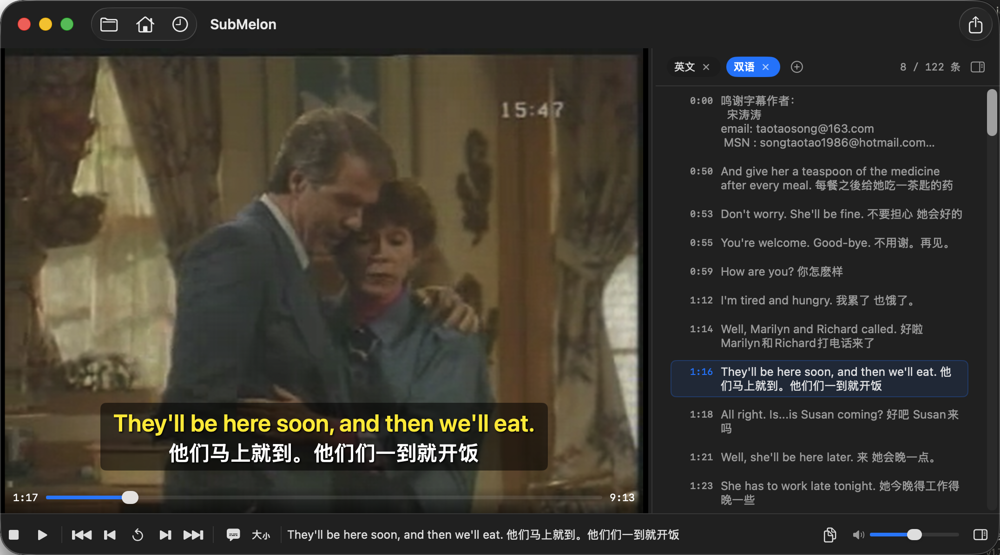

<div align="center">

# 🍈 SubMelon

**macOS 双语字幕播放器 · 专为语言学习设计**

[功能特性](#功能特性) · [快速开始](#快速开始) · [使用方式](#使用方式) · [键盘快捷键](#键盘快捷键) · [打包分发](#打包为-submelonapp)

</div>

---

<div align="center">
  
</div>

> 左侧视频画面实时叠加双语字幕，右侧列表同步高亮跳转；支持英文 + 中文轨道一键合并，160 条字幕即时定位。

---

## 功能特性

### 🎬 视频播放
| 功能 | 说明 |
|------|------|
| **全格式支持** | libmpv 内核，MKV / MP4 / MOV / AVI / WebM / RM 等无格式限制 |
| **双击暂停** | 双击视频画面切换播放 / 暂停，与 Space 键等效 |
| **音量记忆** | 默认 30%，跨会话持久化，重启后保留 |
| **窗口状态保持** | 关窗再打开，视频和字幕状态完整恢复 |

### 📝 字幕系统
| 功能 | 说明 |
|------|------|
| **自动提取** | 内嵌字幕轨道（SRT / ASS / VTT）+ 同名伴随文件，两阶段异步提取，快速首屏显示 |
| **外挂字幕** | 运行时加载 SRT / VTT / ASS，下次打开自动恢复 |
| **双语模式** | 自动配对中英轨道合并显示，重复行去重，同行英中智能拆分 |
| **轨道 Chip** | 侧边栏顶部 Chip 切换轨道，支持拖拽重排；键盘 1 / 2 / 3 快捷键随排序更新 |
| **字幕浮层** | 字幕叠加在视频画面，圆角卡片样式，切轨后自动同步 |
| **删除轨道** | 内置 / 外挂轨道均可点 × 删除，操作前弹窗二次确认 |

### 🎤 语音转字幕
| 功能 | 说明 |
|------|------|
| **Whisper 识别** | 调用 whisper-cli，自动提取 16kHz 音频 → 识别 → 后处理（断句合并），生成 SRT 并即时加载 |
| **双语生成** | macOS 26+ 专属，Translation.framework 翻译英文 SRT 为双语字幕文件 |
| **随时取消** | 识别进行中可点叉号取消，立即终止 ffmpeg / whisper 子进程，静默退出不报错 |
| **模型管理** | 点击当前模型 Chip 直接替换 ggml `.bin` 模型文件，link icon 跳转官方下载 |

### 🗃 字幕导出 & 内嵌
| 功能 | 说明 |
|------|------|
| **CSV 导出** | 导出当前轨道为 CSV（UTF-8 BOM），可直接用 Excel 打开 |
| **内嵌 MKV** | 将外挂 / 识别字幕封装进视频容器，生成新 MKV，最多支持 2 条字幕轨道 |

### 🧭 导航 & 历史
| 功能 | 说明 |
|------|------|
| **三键导航** | 上一条 / 重播当前 / 下一条，键盘 A / S / D |
| **进度条** | 视频内嵌进度条，拖动时侧边栏实时定位对应字幕 |
| **历史记录** | 最近 50 条，含视频缩略图，点击直接续播 |
| **即开即用** | 打包后内含 libmpv + ffmpeg，接收方无需安装任何依赖 |

---

## 系统要求

- **macOS 14 (Sonoma)** 或更高（双语字幕翻译需 macOS 26+）
- **构建机需要**（依赖会自动打包进 .app，接收方不需要）：
  ```bash
  brew install mpv ffmpeg
  ```
- **语音识别需要**（本机运行，不打包）：
  ```bash
  brew install whisper-cpp
  ```

---

## 快速开始

### 开发模式运行

```bash
git clone https://github.com/EddieChan1993/VideoSubtitlePlayer.git
cd VideoSubtitlePlayer
swift run
```

### 使用 build.sh

```bash
bash build.sh --dev   # 开发模式（debug，快速）
bash build.sh         # 全量打包（release + 自动启动）
```

---

## 打包为 SubMelon.app

```bash
# 不绑定（任意设备可用）
./make_app.sh

# 绑定单个用户
./make_app.sh -i user@icloud.com

# 批量打包（逗号分隔）
./make_app.sh -i user1@icloud.com,user2@163.com

# 批量打包（从文件读取，每行一个 Apple ID）
./make_app.sh -l ids.txt

# 自动读取当前登录 Apple ID
./make_app.sh -a
```

**产物命名：**
- 不绑定 → `SubMelon.app`
- 绑定 `hat666666@163.com` → `SubMelon-hat666666.app`

**接收方首次打开（绕过 Gatekeeper）：**
```bash
xattr -rd com.apple.quarantine SubMelon-xxx.app
# 或右键 → 打开 → 打开
```

---

## 使用方式

### 首页

打开应用后进入首页：

- 拖入视频文件，或点击「选择视频…」/ `⌘O`
- 点击历史记录条目直接续播（自动恢复外挂字幕）
- 悬浮在条目上点击 ✕ 删除单条记录（同步清理缩略图缓存）

### 播放中

1. 字幕自动提取，显示在右侧列表及视频浮层
2. 侧边栏顶部 Chip 切换轨道（可拖拽重排，快捷键 1/2/3 随之更新）
3. 点击「+」加载外挂字幕文件（SRT / VTT / ASS）
4. 点击任意字幕行即可跳转播放

**底部控制栏：**
```
■  ▶  |  ⏮  ↺  ⏭  |  👁  |  字幕文本  [复制]  …  音量  位置  侧边栏
```

---

## 键盘快捷键

| 键 | 功能 |
|----|------|
| `Space` | 播放 / 暂停 |
| 双击视频 | 播放 / 暂停 |
| `A` | 上一条字幕 |
| `S` | 重播当前字幕起点 |
| `D` | 下一条字幕 |
| `C` | 复制当前字幕 |
| `Q` | 隐藏 / 显示字幕 |
| `Z` | 折叠 / 展开侧边栏 |
| `1` / `2` / `3` | 切换字幕轨道（顺序随 Chip 拖拽排序） |
| `⌘O` | 打开视频文件 |

---

## 授权绑定

打包时绑定 Apple ID，生成的 `.app` 只能在该账号登录的 Mac 上运行。其他设备打开时弹窗：

> **未授权设备** — 请联系软件授权：wx DC_Wen

批量打包时编译和依赖内置只做一次，每个用户仅额外耗费复制 + 签名时间，效率高。

---

## 版权声明

Copyright © 2026 EddieChan1993. All rights reserved.

本软件（SubMelon）及其源代码受版权法保护。

- **禁止未经授权的商业使用**：未获得作者书面授权，不得将本软件或其任何衍生版本用于任何商业目的，包括但不限于销售、出租、捆绑销售或以盈利为目的的分发。
- **个人学习使用**：仅允许在获得授权的设备上用于个人非商业用途。
- **禁止二次分发**：未经授权不得以任何形式转发、再分发本软件的安装包或源代码。

如需商业授权或合作，请联系：**wx DC_Wen**
